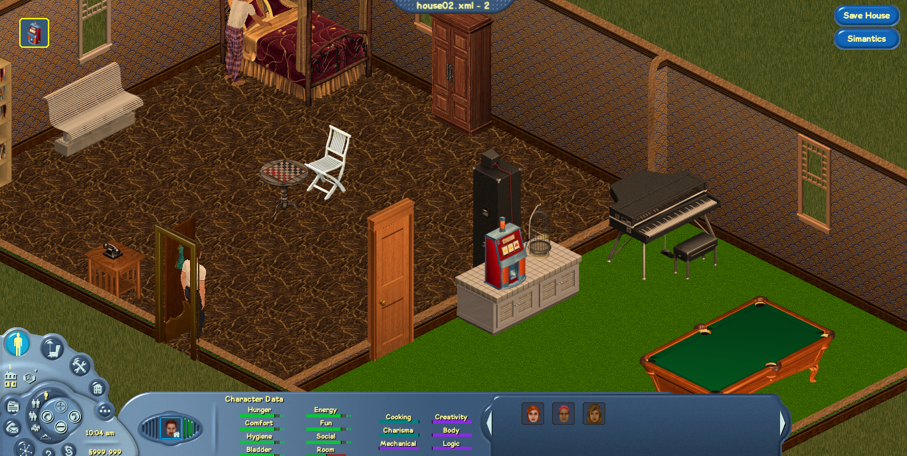

# Project FreeSims

Project FreeSims is intended to be an open source engine recreation of The Sims 1, it still requires the game files for the basic usage, the main purpose is to allow users have an expanded engine with better gameplay experience and new features.

## The Basics.

 Each user create a Sim, and add him to neighborhood, also the user can have their own house and can go work, do his life like in normal game, but you can also visit other players houses, and community lots. Is not intended to be online game.

## Prerequisites

   
    -Windows
    MonoGame: 3.6 or higher
    OpenTK 1.2
    
    -Linux
    OpenGL 3.0
    SDL2
	
## Build

Use Visual Studio 2017 or higher. Mono for Linux.  Run SimsVille.sln to build
	
## Installation

Original game needed, works with Complete Collection or Legacy Collection, install it in default path and run Simsville.
	
# Screenshots

## License

This Source Code Form is subject to the terms of the Mozilla Public License, v. 2.0. If a copy of the MPL was not distributed with this file, You can obtain one at http://mozilla.org/MPL/2.0/.

## Donations

